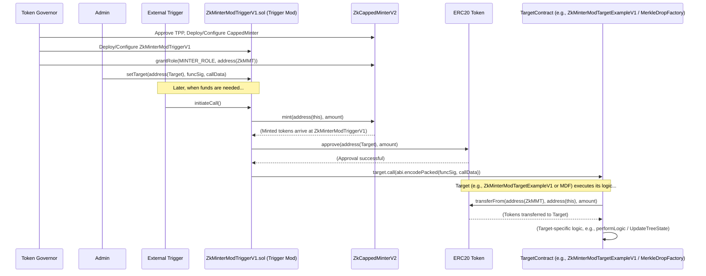
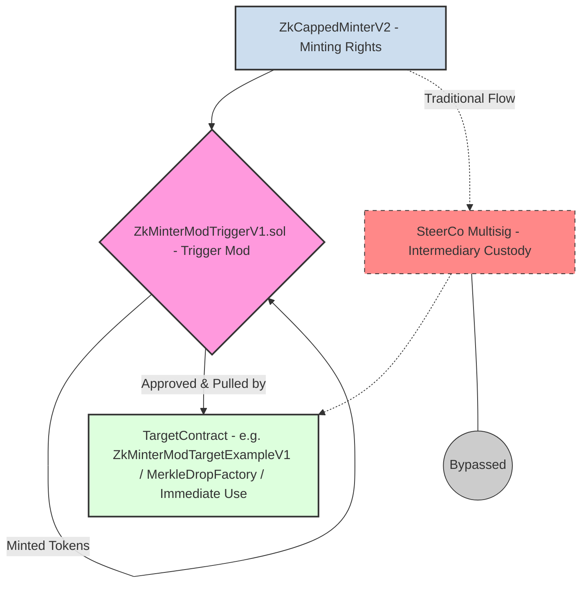

# Trigger Mod: Building Permissionless Pathways by Extending the Capped Minter Framework

## Introduction

The ZKsync ecosystem is continuously evolving to enhance efficiency, security, and decentralisation. A key aspect of this evolution is the management and distribution of tokens through Token Programme Proposals (TPPs). The "Trigger Mod" (primarily embodied by the `ZkMinterModTriggerV1.sol` contract) represents a significant architectural advancement within this framework. It offers a robust solution to automate and secure token flows, bridging the gap between the Capped Minter system and various on-chain applications. This report details the Trigger Mod's architecture, functionality, benefits, and its role in building permissionless, trust-minimised pathways for token distribution.

## 1. Context: The Challenge in Token Programme Execution

### Overall ZKsync Governance & TPP Framework

ZKsync governance relies on TPPs, approved by the **Token Governor** (or **Token Assembly**), to guide initiatives and allocate resources. Central to this is the Capped Minter framework, which empowers the **Token Governor** to grant specific contracts capped minting rights for defined purposes. This ensures controlled token supply and usage.

### Problem Statement: Inefficiencies in Early TPPs

Early TPPs, such as the "Ignite" programme, exposed operational challenges:

- **Manual Friction & Delays:** Token distributions often involved manual interventions by Steering Committees (SteerCos) using multisig wallets.
- **Custody Risks:** Tokens were frequently held in intermediary SteerCo multisigs.
- **Complexity for Signers:** Non-technical multisig signers faced opaque transaction payloads.
- **Lack of Direct Automation:** A gap existed in directly connecting Capped Minters to diverse distribution contracts.

## 2. Goals of the Trigger Mod

The Trigger Mod was designed to address these challenges with the following objectives:

- **Trust Minimisation:** Reduce reliance on human intervention.
- **Automation:** Enable direct, programmatic, "just-in-time" token flows.
- **Efficiency:** Accelerate distributions and reduce operational overhead.
- **Reduced Custody:** Eliminate intermediary token holding.
- **Enhanced Security:** Minimise attack surfaces by streamlining token flows.

## 3. Core Concepts & Terminology

Understanding the Trigger Mod requires familiarity with these key concepts:

- **Token Governor / Token Assembly:** The governance body approving TPPs and setting rules for token programmes.
- **Capped Minter (e.g., `ZkCappedMinterV2.sol`):** A contract minting tokens up to a cap, with `ZkMinterModTriggerV1.sol` holding `MINTER_ROLE`.
- **Steering Committee (SteerCo):** Group previously handling manual TPP execution.
- **Permissionless Pathways:** Automated token flows once configured.
- **"Mint on Demand" / "Just-in-Time Minting":** `ZkMinterModTriggerV1.sol` mints tokens only when needed by the `TargetContract`. Minting rights represent the potential to create tokens, which are only converted into actual, liquid ERC20 tokens (governed by the **ZK token contract**) at the precise moment they are required for use by a target application. The Trigger Mod facilitates this conversion and immediate direction of tokens.
- **Automaton:** `ZkMinterModTriggerV1.sol` as a self-operating mechanism.
- **Target Contract:** Any contract receiving tokens from `ZkMinterModTriggerV1.sol`. `ZkMinterModTargetExampleV1.sol` is an illustrative example.

## 4. "Trigger Mod" Solution Architecture

The Trigger Mod is an architectural pattern with `ZkMinterModTriggerV1.sol` (the "trigger" contract) as its reference implementation. It's an intermediary connecting a `ZkCappedMinterV2` to a `TargetContract`.

### Key Components & Roles

- **`ZkMinterModTriggerV1.sol` (The "Trigger Mod" Contract):**
    - **Role:** The central orchestrator. Holds `MINTER_ROLE` on a `ZkCappedMinterV2`.
    - **Configuration:** Initialised with an `admin` address, the `token` address, `target` contract address, the `functionSignature`, and `callData` for the target function. The `minter` address is configured post-deployment via `setMinter()` by the `admin`.
    - **Core Functionality - `initiateCall()`:**
        1. Determines the amount of tokens available to mint (up to the `minter`'s cap) and mints these tokens from `minter` to itself.
        2. Approves the `target` contract to spend these minted tokens.
        3. Constructs the full call data by combining `functionSignature` and `callData`, then calls the specified function on the `target` with this data.
- **`ZkCappedMinterV2.sol`:**
    - **Role:** The ultimate source of tokens, enforcing TPP caps set by the **Token Governor**. Grants `MINTER_ROLE` to `ZkMinterModTriggerV1.sol`.

### Understanding Target Contracts: `ZkMinterModTargetExampleV1.sol` and `MerkleDropFactory.sol`

The power of `ZkMinterModTriggerV1.sol` lies in its ability to interact with *any* contract designed to receive tokens. We'll explore two examples: `ZkMinterModTargetExampleV1.sol` as a generic template, and `MerkleDropFactory.sol` as a specific, practical application.

- **`ZkMinterModTargetExampleV1.sol` (Illustrative Generic Target):**
    - **Purpose:** This contract serves as a clear, simple template demonstrating the *pattern* a target contract follows when interacting with `ZkMinterModTriggerV1.sol`. It's not meant for a single specific use case but rather to show the fundamental mechanics.
    - **Interaction Flow:**
        1. `ZkMinterModTriggerV1.sol`, after minting and approving tokens, calls a designated function on `ZkMinterModTargetExampleV1.sol` (e.g., `executeTransferAndLogic`).
        2. Inside `executeTransferAndLogic`, `ZkMinterModTargetExampleV1.sol` uses the standard ERC20 `transferFrom` function to pull the tokens that `ZkMinterModTriggerV1.sol` has made available (`ZkMinterModTriggerV1.sol` is `msg.sender` in this call). The `from` address in `transferFrom` is effectively `address(ZkMinterModTriggerV1)`.
        3. After securing the tokens, `ZkMinterModTargetExampleV1.sol` can then execute its own specific business logic (represented by a `performLogic()` function). This logic is placeholder and would be implemented by developers for their specific needs (e.g., recording a deposit, updating state, forwarding funds).
    - **Diagram: `ZkMinterModTriggerV1` with `ZkMinterModTargetExampleV1`**
        
        ```mermaid
        sequenceDiagram
            participant ZkMMT as ZkMinterModTriggerV1.sol
            participant Token as ERC20 Token
            participant ZkMMTEV1 as ZkMinterModTargetExampleV1.sol
        
            ZkMMT->>Token: approve(address(ZkMMTEV1), amount)
            Token-->>ZkMMT: Approval Confirmed
            ZkMMT->>ZkMMTEV1: executeTransferAndLogic(address(Token), address(ZkMMT), amount)
        
            activate ZkMMTEV1
            ZkMMTEV1->>Token: transferFrom(address(ZkMMT), address(this), amount)
            Token-->>ZkMMTEV1: Tokens Transferred
            ZkMMTEV1->>ZkMMTEV1: performLogic()
            deactivate ZkMMTEV1
            ZkMMTEV1-->>ZkMMT: (Execution Complete)
        
        ```
        
    - **Significance:** `ZkMinterModTargetExampleV1.sol` clarifies the "pull" part of the interaction. It shows that target contracts don't need to be minter-aware; they just need a way to receive an approved token transfer.
- **`MerkleDropFactory.sol` (Concrete Target Example - Airdrop Funding):**
    - **Purpose:** This is a real-world example of a target contract. A `MerkleDropFactory` is used to create and manage Merkle tree-based airdrops, allowing efficient distribution of tokens to many recipients.
    - **Interaction Flow:**
        1. `ZkMinterModTriggerV1.sol` is configured with the `MerkleDropFactory`'s address and the specific function signature for depositing tokens (e.g., `depositTokens(bytes32 treeId, uint256 amount)`).
        2. When `initiateCall()` is triggered, `ZkMinterModTriggerV1.sol` mints the required token `amount` and approves the `MerkleDropFactory` contract.
        3. `ZkMinterModTriggerV1.sol` then calls `MerkleDropFactory.depositTokens(...)`, passing the `treeId` for the airdrop and the `amount` of tokens.
        4. The `MerkleDropFactory` would then internally use `transferFrom` to pull the approved tokens from `ZkMinterModTriggerV1.sol` and credit them to the specified Merkle tree, making them available for claiming by eligible airdrop recipients.
    - **Diagram: `ZkMinterModTriggerV1` with `MerkleDropFactory`**
        
        ```mermaid
        sequenceDiagram
            participant ZkMMT as ZkMinterModTriggerV1.sol
            participant Token as ERC20 Token
            participant MDF as MerkleDropFactory.sol
        
            ZkMMT->>Token: approve(address(MDF), amount)
            Token-->>ZkMMT: Approval Confirmed
            ZkMMT->>MDF: depositTokens(treeId, amount)
        
            activate MDF
            MDF->>Token: transferFrom(address(ZkMMT), address(this), amount)
            Token-->>MDF: Tokens Transferred to Tree Fund
            MDF->>MDF: UpdateTreeState(treeId, amount)
            deactivate MDF
            MDF-->>ZkMMT: (Deposit Complete)
        
        ```
        
    - **Significance:** This illustrates how `ZkMinterModTriggerV1.sol` automates the funding of complex applications like airdrops, removing manual treasury management steps and reducing custodial risk for the funds allocated to the airdrop.

### Overall Token and Control Flow

The general interaction managed by `ZkMinterModTriggerV1.sol` remains consistent:



### Custody Flow

ZkMinterModTriggerV1.sol ensures tokens bypass intermediary custodial wallets:



### Access Control

- **ZkMinterModTriggerV1.sol Configuration:** Restricted to the `admin`.
- **Triggering initiateCall():** Flexible (permissionless or role-restricted).
- **Overall Programme Control:** Via ZkCappedMinterV2 by the Token Governor.

## 5. Benefits & Outcomes

The Trigger Mod pattern is a minter mod that aims to be part of the design language for TPPs, it enables:

- Reduced Custody Risk
- Significant Automation Possibilities
- Increased Efficiency & Speed
- Composability & Reusability
- Enhanced Programme Auditability
- "Mint on Demand"
- Improved Operational Security

## 6. Use Cases & Examples

The trigger mod enables a very broad use case set, limited only by the functionality of the target smart contract. Some examples of potential use cases include:

- Automated Airdrop Funding (e.g., MerkleDropFactory.sol and distribution systems such as Merkl).
- Automated Service Provider Payments.
- Staking/Liquidity Pool Funding.
- TPP DeFi integration

## 7. Conclusion: Paving the Way for Advanced Governance Operations

The Trigger Mod is a strategic enabler for ZKsync Token Programmes. It is an incremental step towards more trust minimised and automated "permissionless pathways".

Learning from Ignite, the mechanism cuts down on custodial risk and operational drag, unlocking new possibilities for TPPs by facilitating token minting directly to target smart contracts.